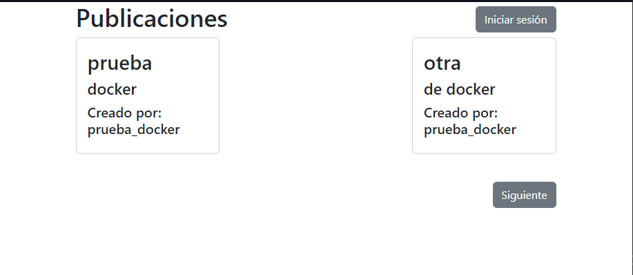
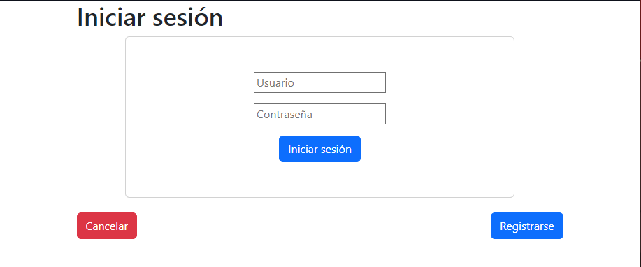
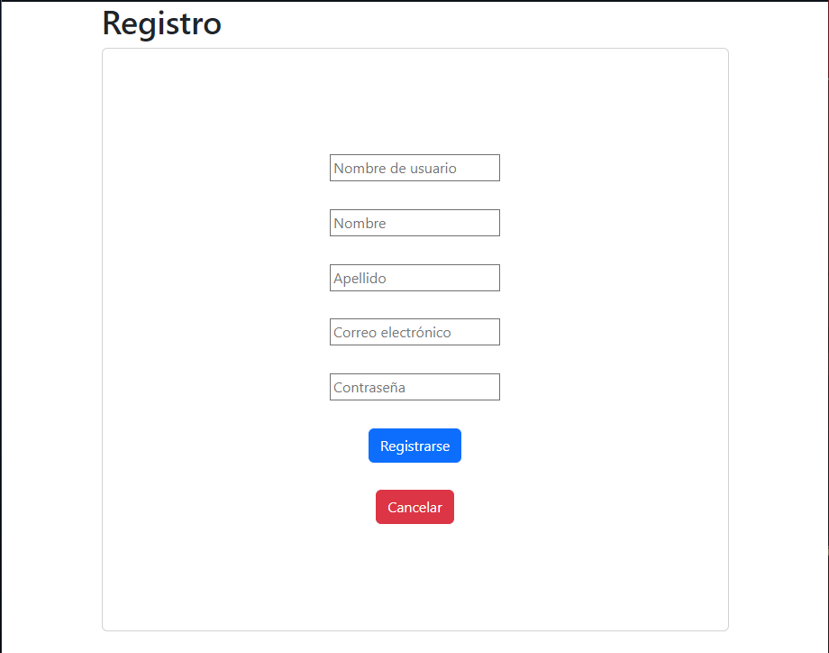
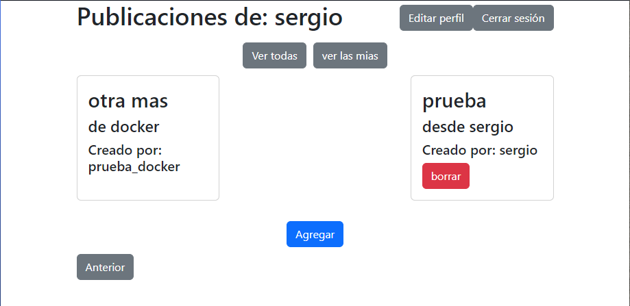

# Prueba Finanzauto

Prueba desarrollada usando Django Rest Framework para el desarrollo de 2 microservicios, uno encargado de la administración y gestión de la autenticación de usuarios y el segundo encargado de las publicaciones que los primeros pueden hacer.

Por su parte el frontend está construido en React y tanto el back como front se encuentran configurados para su despliegue en Docker.

## Tecnologías

- **Backend**: Django Rest Framework v3.15.2
- **Frontend**: React
- **Base de datos**: PostgreSQL v14

## Comunicación de los servicios

Para este apartado, el servicio de publicaciones cuenta con una función (en el archivo de ``utils.py``) la cual permite que este servicio realice solicitudes al servicio de usuarios, puntualmente preguntando por la información de un usuario en base a su token de acceso.

## Instalación

Clonar el repositorio

``
git clone https://github.com/ser0710/prueba_finanzauto.git
``

En la ruta del proyecto

``
docker-compose up --build
``

Una vez se termine de levantar los contenedores

Ejecutar migraciones de ambos microservicios

``
docker-compose exec usuariosapi python manage.py migrate
``

``
docker-compose exec publicacionesapi python manage.py migrate
``

## Uso

Acceder a la url: [http://localhost:3000](http://localhost:3000)

Primera pestaña en la cual se podrán visualizar todas las publicaciones creadas por los diferentes usuarios.

Para el registro de usuario o inicio de sesión se debe acceder dando en el botón de "iniciar sesión". Como requisito para la contraseña se espera que esta sea de al menos 8 dígitos, tenga un carácter en mayúscula y un número.

De esta forma se presenta la siguiente interfaz donde el usuario puede ver las publicaciones creadas por el mismo y por otros usuarios.

## Endpoints

### Usuarios

- ``POST /api/register/`` - Permite el registro de un usuario
- ``POST /api/login/`` - Permite que un usuario inicie sesión con sus credenciales
- ``GET /api/user_data/`` - Retorna la información de un usuario
- ``PUT /api/update_user/`` - Permite actualizar la información de un usuario

### Publicaciones
- ``POST /api/publicate/`` - Permite que un usuario realice una publicación
- ``GET /api/publication/{id}/`` - Lista las publicaciones de un usuario
- ``DELETE /api/publication/{id}/`` - Elimina una publicación
- ``GET /api/publications/`` - Lista todas las publicaciones
